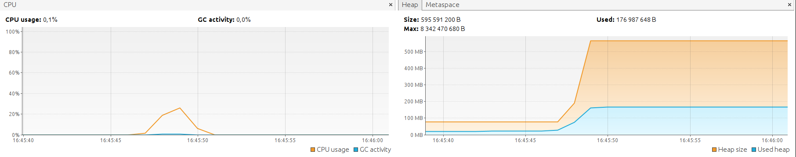
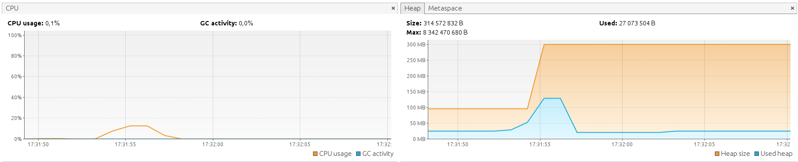
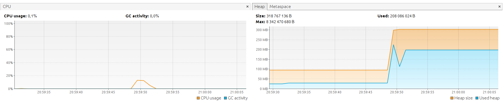

# How to use

1. Run the service by executing `./gradlew bootRun` in the main project folder
2. Test the service, for example, by following command:
```bash
curl http://localhost:8080/count -F file=@input_unique_words.txt
```
it will count word frequency in the 16MB file containing 1 million of unique strings. On my machine, it lasted about 1.2s and took ~180MB of memory:



Next example is the file containing some real text repeated thousands of times, which resulted of ~49MB file with 378 unique strings:
```bash
curl http://localhost:8080/count -F file=@input_repeating_words.txt
```
On my machine, it lasted about 1.5s and took ~130MB of memory:


Last example is the 46MB file containing ~90k unique words taken from 1 million random generated strings corpus. Counting lasted ~2s and took ~200MB of memory:
```bash
curl http://localhost:8080/count -F file=@input_largest_memory.txt
```

